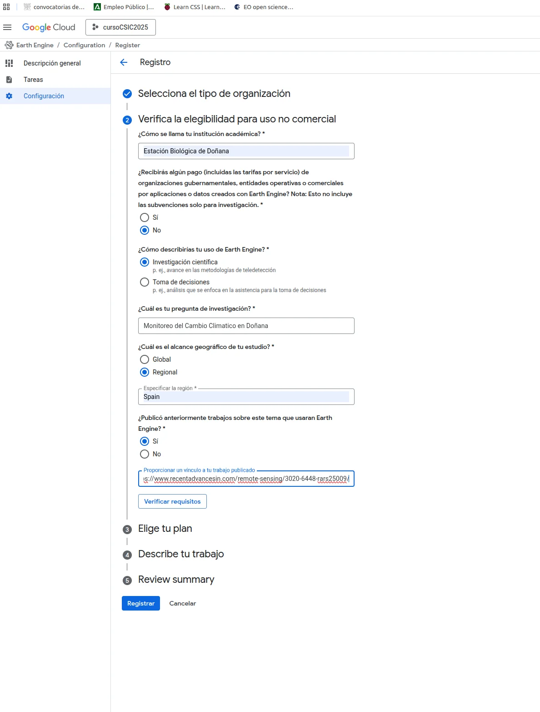
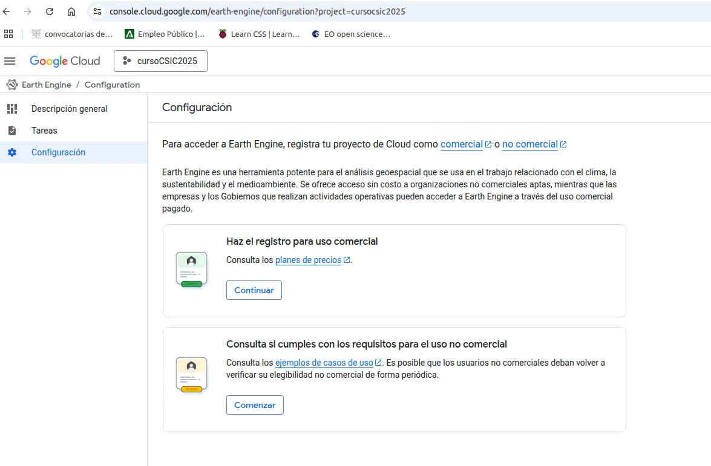

# Configuración de Google Earth Engine con Google Cloud Project

## ⚠️ Importante - Nuevo Requisito 2025

A partir de 2025, **es obligatorio** tener una cuenta de Google Cloud Project (GCP) vinculada para poder usar Google Earth Engine. Este documento te guiará paso a paso en el proceso de configuración.

## Requisitos Previos

- Cuenta de Google (Gmail)
- Acceso a internet
- Navegador web actualizado (Chrome, Firefox, Edge)

---

## 1. Crear Proyecto en Google Cloud

### 1.1. Acceder a Google Cloud Console

1. Ve a [Google Cloud Console](https://console.cloud.google.com/)
2. Inicia sesión con tu cuenta de Google
3. Si es la primera vez, acepta los términos y condiciones

### 1.2. Crear un Nuevo Proyecto

1. En la parte superior, haz clic en el selector de proyectos
2. Clic en **"Nuevo Proyecto"** (New Project)
3. Asigna un nombre descriptivo (ejemplo: `curso-gee-2025`, `gee-csic-2025`, etc.)
4. Haz clic en **"Crear"**

> 💡 **Nota**: El ID del proyecto debe ser único a nivel global. Google puede añadir números al final si el nombre ya existe.

---

## 2. Registrar el Proyecto en Earth Engine

### 2.1. Acceder a la Configuración de Earth Engine

1. Ve a [Earth Engine Configuration](https://console.cloud.google.com/earth-engine/configuration)
2. Selecciona tu proyecto recién creado en el selector de la parte superior
3. En el menú lateral, haz clic en **"Configuración"**



### 2.2. Elegir Tipo de Registro

Earth Engine ofrece dos tipos de registro:

- **Uso Comercial** (Requiere pago)
- **Uso No Comercial** (Gratuito para investigación y educación)

Para este curso, selecciona **"Comenzar"** en la opción de **Uso No Comercial**.

### 2.3. Completar el Formulario de Registro

Ahora deberás completar un formulario para verificar tu elegibilidad:



#### Paso 1: Selecciona el tipo de organización
- ✅ Organización académica o de investigación sin ánimo de lucro
- ❌ Otro tipo de organización

#### Paso 2: Verifica la elegibilidad para uso no comercial

**¿Cómo se llama tu institución académica?**
- Ejemplo: `Universidad de [Tu Ciudad]`, `CSIC - Estación Biológica de Doñana`, etc.

**¿Recibirás algún pago de organizaciones gubernamentales, entidades operativas o comerciales?**
- Selecciona **No** (para uso académico/educativo)

**¿Cómo describirías tu uso de Earth Engine?**
- Selecciona **Investigación científica**
  - Ejemplo: _"análisis en las metodologías de teledetección"_

**¿Cuál es tu pregunta de investigación?**
- Describe brevemente el objetivo de tu proyecto
- Ejemplo: `Monitoreo del Cambio Climático en Doñana`, `Análisis de cobertura vegetal`, `Curso de teledetección`, etc.

**¿Cuál es el alcance geográfico de tu estudio?**
- **Global**: Estudios a escala mundial
- **Regional**: Estudios en países o regiones específicas (selecciona esta opción para España)
  - Si seleccionas Regional, especifica: `Spain` o la región que corresponda

**¿Publicas anteriormente trabajos sobre este tema que usaran Earth Engine?**
- Selecciona **Sí** si tienes publicaciones previas y proporciona el enlace
- Selecciona **No** si es tu primera vez

#### Paso 3: Elige tu plan
- El plan gratuito es suficiente para el curso

#### Paso 4: Describe tu trabajo
- Puedes ampliar la información sobre tu investigación o proyecto

#### Paso 5: Revisa el resumen
- Verifica que toda la información sea correcta

### 2.4. Enviar el Registro

1. Haz clic en **"Registrar"**
2. El proceso de aprobación puede tardar desde unos minutos hasta 24-48 horas
3. Recibirás un email de confirmación cuando tu acceso sea aprobado

> ⚠️ **Importante**: Realiza este registro **antes del inicio del curso** para evitar retrasos.

---

## 3. Verificar el Acceso a Earth Engine

Una vez aprobado tu registro:

### 3.1. Code Editor (JavaScript)

1. Ve a [https://code.earthengine.google.com/](https://code.earthengine.google.com/)
2. Selecciona tu proyecto de Google Cloud en el selector superior
3. Deberías ver el editor de código sin mensajes de error

### 3.2. Python (para días posteriores del curso)

Para verificar el acceso desde Python, ejecuta:

```python
import ee

# Autenticación
ee.Authenticate()

# Inicialización con tu proyecto
ee.Initialize(project='tu-proyecto-id')

# Test básico
image = ee.Image('USGS/SRTMGL1_003')
print('Acceso correcto a Earth Engine!')
```

---

## 4. Solución de Problemas Comunes

### Problema: "El proyecto no está registrado en Earth Engine"
**Solución**: Asegúrate de haber completado el registro en la sección de configuración de Earth Engine y espera la aprobación.

### Problema: "No puedo seleccionar mi proyecto"
**Solución**: Verifica que estás usando la misma cuenta de Google con la que creaste el proyecto GCP.

### Problema: "El registro está pendiente desde hace más de 48 horas"
**Solución**: Revisa tu email (incluyendo spam). Si no hay respuesta, contacta con [earthengine-support@google.com](mailto:earthengine-support@google.com).

### Problema: "Error de autenticación en Python"
**Solución**: 
1. Ejecuta `earthengine authenticate` en terminal
2. Sigue el proceso de autenticación en el navegador
3. Copia el código de autorización

---

## 5. Recursos Adicionales

- [Documentación oficial de Earth Engine](https://developers.google.com/earth-engine)
- [Guía de registro de Earth Engine](https://earthengine.google.com/signup/)
- [Earth Engine API Python](https://developers.google.com/earth-engine/guides/python_install)
- [Foro de Earth Engine](https://groups.google.com/g/google-earth-engine-developers)

---

## 📝 Checklist Pre-Curso

Antes de comenzar el curso, asegúrate de tener:

- ✅ Cuenta de Google activa
- ✅ Proyecto de Google Cloud creado
- ✅ Registro en Earth Engine completado y aprobado
- ✅ Acceso verificado al Code Editor
- ✅ (Opcional) Python 3.x instalado para los días de Python

---

