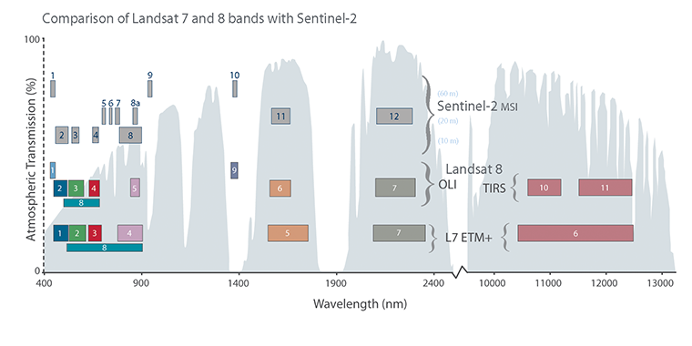

# Día 2 - Índices Espectrales y Estadísticas Zonales

## 🎯 Resumen de la Sesión

En el segundo día del curso consolidamos conceptos fundamentales del Día 1 y avanzamos en dos áreas clave:
- **Cálculo de índices espectrales** con imágenes Landsat 8
- **Estadísticas zonales** cruzando datos raster con vectoriales

## 🛰️ Introducción a la Teledetección

Antes de trabajar con los scripts, vimos una introducción a los conceptos fundamentales de la teledetección que son esenciales para entender cómo funcionan los índices espectrales.

### Conceptos Básicos

**Teledetección** es la técnica de obtener información sobre objetos o áreas desde la distancia, típicamente desde satélites o aviones, sin contacto físico directo.

### El Espectro Electromagnético

La teledetección se basa en la medición de la **radiación electromagnética** que los objetos reflejan o emiten. Diferentes materiales interactúan de manera única con diferentes longitudes de onda:

- **Luz Visible** (400-700 nm): Lo que ve el ojo humano
  - Azul: ~450-495 nm
  - Verde: ~495-570 nm
  - Rojo: ~620-750 nm
  
- **Infrarrojo Cercano (NIR)** (~700-1400 nm): Clave para detectar vegetación saludable
  
- **Infrarrojo de Onda Corta (SWIR)** (~1400-3000 nm): Útil para detectar agua y humedad

- **Infrarrojo Térmico** (~8000-14000 nm): Mide temperatura

### Bandas Espectrales en Satélites

Los satélites capturan imágenes en diferentes **bandas espectrales** (rangos específicos de longitudes de onda). Esto permite analizar cómo diferentes materiales reflejan la luz:


*Comparación de las bandas espectrales de Landsat 7, Landsat 8 y Sentinel-2*

#### Landsat 8 (Usado en este curso)

| Banda | Nombre | Longitud de onda | Resolución | Uso principal |
|-------|--------|------------------|------------|---------------|
| B1 | Coastal Aerosol | 430-450 nm | 30 m | Estudios costeros |
| B2 | Blue | 450-510 nm | 30 m | Agua, suelo |
| B3 | Green | 530-590 nm | 30 m | Vegetación |
| B4 | Red | 640-670 nm | 30 m | Vegetación |
| B5 | NIR | 850-880 nm | 30 m | Biomasa, vegetación |
| B6 | SWIR 1 | 1570-1650 nm | 30 m | Humedad, agua |
| B7 | SWIR 2 | 2110-2290 nm | 30 m | Geología, suelos |
| B10-11 | Thermal | 10600-12510 nm | 100 m | Temperatura |

### ¿Por Qué Usamos Diferentes Bandas?

Cada material tiene una **firma espectral** única (patrón de reflexión):

- **Vegetación saludable**: 
  - Absorbe rojo (fotosíntesis)
  - Refleja mucho NIR (estructura celular)
  - Por eso el NDVI = (NIR - Red) / (NIR + Red) funciona

- **Agua**:
  - Absorbe NIR y SWIR
  - Refleja más en verde
  - Por eso el MNDWI = (Green - SWIR) / (Green + SWIR) detecta agua

- **Suelo desnudo**:
  - Refleja uniformemente en visible
  - Menos reflexión en NIR que vegetación

### Diferencias Landsat vs Sentinel-2

| Característica | Landsat 8 | Sentinel-2 |
|----------------|-----------|------------|
| Resolución espacial | 30 m (óptico) | 10-20 m |
| Resolución temporal | 16 días | 5 días |
| Bandas espectrales | 11 bandas | 13 bandas |
| Disponibilidad | Desde 1972 (programa) | Desde 2015 |
| Cobertura | Global | Global |
| Acceso | Gratuito | Gratuito |

**En este curso usamos principalmente Landsat 8** por su amplio historial de datos y consistencia temporal.

### Aplicaciones de la Teledetección

- 🌱 **Agricultura**: Monitoreo de cultivos, estimación de rendimientos
- 🌳 **Bosques**: Detección de deforestación, salud forestal
- 💧 **Agua**: Calidad del agua, detección de cuerpos de agua
- 🏙️ **Urbano**: Crecimiento urbano, planificación territorial
- 🌋 **Desastres**: Incendios, inundaciones, erupciones volcánicas
- ❄️ **Clima**: Glaciares, nieve, cambio climático

### Relación con los Índices Espectrales

Los **índices espectrales** que calculamos en este día (NDVI, MNDWI, SAVI) son fórmulas matemáticas que combinan diferentes bandas para resaltar características específicas:

- Aprovechan las diferencias en reflexión entre bandas
- Normalizan los valores para comparabilidad
- Reducen efectos atmosféricos y de iluminación
- Facilitan la interpretación y clasificación

---

## 📚 Contenidos Trabajados

### Script 6: Cálculo de Índices Espectrales
**Archivo:** `06_ndvi_image.js`

#### Temas Cubiertos

**1. Trabajo con Imágenes Landsat 8**
- Carga de imágenes Landsat 8 Collection 2 (Surface Reflectance)
- Conversión de Digital Numbers a reflectancia de superficie
- Aplicación de factores de escala: `(DN × 0.0000275) - 0.2`
- Renombrado de bandas con nombres descriptivos

**2. Cálculo de Índices Espectrales**

Aprendimos **tres métodos diferentes** para calcular el NDVI:

```javascript
// Método 1: Cálculo manual
var ndvi_1 = b5.subtract(b4).divide(b5.add(b4));

// Método 2: Función normalizada (más eficiente)
var ndvi_2 = composite.normalizedDifference(["Nir", "Red"]);

// Método 3: Usando expresiones (útil para fórmulas complejas)
var ndvi_3 = composite.expression(
  "(b5 - b4) / (b5 + b4)", 
  {b5: composite.select("Nir"), b4: composite.select("Red")}
);
```

**Índices Trabajados:**
- **NDVI** (Normalized Difference Vegetation Index): `(NIR - Red) / (NIR + Red)`
- **MNDWI** (Modified Normalized Difference Water Index): `(Green - SWIR) / (Green + SWIR)`
- **SAVI** (Soil-Adjusted Vegetation Index): `1.5 × ((NIR - Red) / (NIR + Red + 0.5))`

**3. Trabajo con Máscaras**
- Aplicar máscaras basadas en valores (`updateMask()`)
- Crear máscaras para mostrar solo agua (MNDWI >= 0)
- Clasificación por umbrales usando `.where()`

**4. Clasificación de Índices**
```javascript
var ndvi_classes = ndvi_1.updateMask(ndvi_1.mask())
  .where(ndvi_1.lt(0.2), 1)                      // Vegetación escasa
  .where(ndvi_1.gte(0.2).and(ndvi_1.lt(0.5)), 2) // Vegetación moderada
  .where(ndvi_1.gte(0.5), 3);                    // Vegetación densa
```

**5. Visualización con Paletas de Color**
- Configuración de parámetros de visualización (`min`, `max`, `palette`)
- Uso de diferentes esquemas de color para distintos índices

### Script 7: Modelo Digital de Elevación (DEM)
**Archivo:** `07_srtm_munis.js`

#### Temas Cubiertos

**1. Trabajo con SRTM**
- Carga del dataset SRTM (Shuttle Radar Topography Mission)
- Resolución: 90 metros
- Dataset global de elevación

**2. Derivación de Productos Topográficos**
```javascript
var elevation = dataset.select('elevation');
var slope = ee.Terrain.slope(elevation);     // Pendiente en grados
var aspect = ee.Terrain.aspect(elevation);   // Orientación de la pendiente
```

**3. Creación de Imágenes Multi-banda**
```javascript
var full = ee.Image.cat([elevation, slope, aspect]);
```

**4. Estadísticas Zonales - Conceptos Clave**

**`reduceRegion()`** - Para UNA geometría:
```javascript
var roiStats = full.reduceRegion({
  reducer: ee.Reducer.max(),
  geometry: roi,
  scale: 90,
  maxPixels: 1e9
});
```

**`reduceRegions()`** - Para MÚLTIPLES geometrías:
```javascript
var selStats = full.reduceRegions({
  collection: munis.select(['nombre']),
  reducer: ee.Reducer.mean(),
  scale: 30
});
```

**5. Reductores Trabajados**
- `ee.Reducer.mean()` - Media
- `ee.Reducer.median()` - Mediana
- `ee.Reducer.max()` - Máximo
- `ee.Reducer.min()` - Mínimo

**6. Cruce de Raster con Vectorial**
- Filtrado de features con `ee.Filter`
- Cálculo de estadísticas por municipio
- Mantener propiedades originales en los resultados

**7. Visualización de Vectores**
```javascript
// Método 1: paint()
var outline = empty.paint({
  featureCollection: andalucia,
  width: 2
});

// Método 2: draw()
andalucia.draw({color: '006600', strokeWidth: 5})
```

**8. Exportación de Resultados**
```javascript
Export.table.toDrive({
  collection: selStats,
  description: 'Estadisticas_Topografia_Municipios',
  folder: 'GEE_Curso_2025',
  fileFormat: 'CSV'
});
```

## 🔑 Conceptos Clave Aprendidos

### Índices Espectrales

| Índice | Fórmula | Rango | Interpretación |
|--------|---------|-------|----------------|
| **NDVI** | (NIR - Red) / (NIR + Red) | -1 a 1 | < 0: Agua<br>0-0.2: Suelo desnudo<br>0.2-0.5: Vegetación dispersa<br>> 0.5: Vegetación densa |
| **MNDWI** | (Green - SWIR) / (Green + SWIR) | -1 a 1 | > 0: Agua |
| **SAVI** | 1.5 × ((NIR - Red) / (NIR + Red + 0.5)) | Similar a NDVI | Ajustado para áreas con suelo expuesto |

### Diferencias Importantes

**`reduceRegion()` vs `reduceRegions()`**

| Función | Entrada | Salida | Uso |
|---------|---------|--------|-----|
| `reduceRegion()` | 1 geometría | Dictionary | Estadísticas de un área |
| `reduceRegions()` | FeatureCollection | FeatureCollection | Estadísticas de múltiples áreas |

### Parámetros Críticos

- **`scale`**: Resolución del análisis en metros (crucial para resultados correctos)
- **`maxPixels`**: Límite de píxeles a procesar (aumentar para áreas grandes)
- **`geometry`/`collection`**: Define el área de análisis

## 💡 Técnicas Aprendidas

1. **Tres formas de calcular índices** (manual, funciones, expresiones)
2. **Aplicar máscaras** para filtrar píxeles por criterios
3. **Clasificar valores** usando `.where()` con operadores lógicos
4. **Combinar bandas** en imágenes multi-banda
5. **Calcular estadísticas zonales** sobre geometrías
6. **Exportar resultados** a CSV en Google Drive
7. **Visualizar vectores** con `paint()` y `draw()`

## ✅ Ejercicios Realizables

### Nivel Básico
- [ ] Calcular el NDVI de una imagen Landsat de tu región
- [ ] Crear una máscara para mostrar solo vegetación (NDVI > 0.4)
- [ ] Calcular la elevación media de un área de interés

### Nivel Intermedio
- [ ] Clasificar una imagen en 4 categorías según NDVI
- [ ] Calcular estadísticas de elevación para varios municipios
- [ ] Crear un mapa que combine NDVI y MNDWI para diferenciar vegetación y agua

### Nivel Avanzado
- [ ] Calcular el área de cada categoría de NDVI
- [ ] Encontrar el municipio con mayor pendiente media
- [ ] Exportar estadísticas topográficas de toda una provincia

## 📚 Recursos de Referencia

### Documentación Oficial
- [Image Collections](https://developers.google.com/earth-engine/guides/ic_creating)
- [Reducers](https://developers.google.com/earth-engine/guides/reducers_intro)
- [Masking](https://developers.google.com/earth-engine/guides/image_mask)
- [Exporting Data](https://developers.google.com/earth-engine/guides/exporting)

### Datasets Utilizados
- [Landsat 8 Collection 2 Surface Reflectance](https://developers.google.com/earth-engine/datasets/catalog/LANDSAT_LC08_C02_T1_L2)
- [SRTM Digital Elevation Data](https://developers.google.com/earth-engine/datasets/catalog/CGIAR_SRTM90_V4)

## 🎓 Para Profundizar

### Sobre Índices Espectrales
- ¿Por qué el NDVI usa NIR y Red? (relación con fotosíntesis y estructura celular)
- ¿Cuándo es mejor usar SAVI en lugar de NDVI? (vegetación dispersa, suelo expuesto)
- ¿Qué otros índices existen? (EVI, NDBI, NDSI, etc.)

### Sobre Estadísticas Zonales
- ¿Cómo afecta el parámetro `scale` a los resultados?
- ¿Qué otros reductores están disponibles? (percentiles, histogramas, etc.)
- ¿Cómo combinar múltiples reductores en una sola operación?

### Sobre Topografía
- ¿Para qué se usa el aspecto (orientation)?
- ¿Cómo crear un hillshade para visualización?
- ¿Qué es el dataset ALOS PALSAR y cuándo usarlo?

## 🔄 Contenidos Pendientes para Próximas Sesiones

Los siguientes temas estaban planificados para el Día 2 pero no se cubrieron:

- Script 8: Combinando DEM y datos espectrales
- Script 9: Estadísticas zonales avanzadas (histogramas, grupos)
- Datos radar (SAR) para tráfico marítimo
- Datos de luminosidad nocturna (VIIRS)
- Composiciones temporales (máximo, media, mediana)
- Análisis de series temporales

Estos temas probablemente se verán en sesiones futuras.

## 💡 Consejos Prácticos

1. **Usa `.normalizedDifference()`** en lugar de cálculos manuales cuando sea posible
2. **Ajusta el `scale`** según la resolución de tus datos (30m para Landsat, 90m para SRTM)
3. **Combina reductores** para obtener múltiples estadísticas en una sola operación
4. **Verifica las propiedades** de tus FeatureCollections antes de hacer reduceRegions
5. **Usa `false` en Map.addLayer** para capas de referencia que no necesitas ver siempre

## 🎯 Preparación para la Próxima Sesión

Es probable que en la siguiente sesión se trabaje con:
- Series temporales de imágenes
- Composiciones y reducción temporal
- Análisis de cambios
- Clasificación de imágenes
- Proyectos más complejos combinando múltiples técnicas

---

## 📌 Notas Importantes

- Los scripts requieren tener dibujado un ROI o tener cargado un FeatureCollection de municipios
- Para ejecutar las exportaciones, hay que ir a la pestaña "Tasks" y hacer clic en "Run"
- Los tres métodos de calcular NDVI producen el mismo resultado, pero tienen diferentes aplicaciones según la complejidad de la fórmula
- Siempre verifica que el `scale` corresponda con la resolución de tus datos

---

*README actualizado después de la sesión del Día 2*
