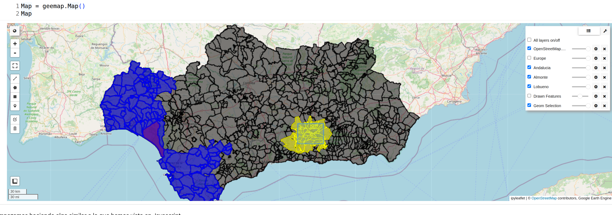
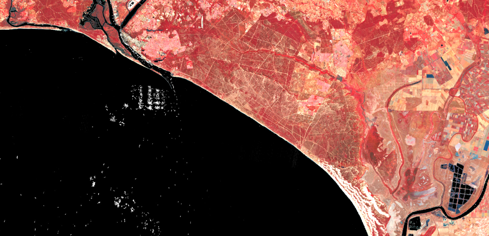

# Curso Intensivo de Google Earth Engine 2025 - Resumen Completo

## 🌍 Introducción

Este repositorio documenta un **curso intensivo de 5 días sobre Google Earth Engine (GEE)**, donde hemos explorado esta poderosa plataforma de análisis geoespacial usando tanto **JavaScript** como **Python**.

Google Earth Engine combina un catálogo multi-petabyte de imágenes satelitales y conjuntos de datos geoespaciales con capacidades de análisis a escala planetaria. Durante este curso, hemos aprendido a aprovechar estas capacidades para realizar análisis de teledetección complejos de manera eficiente.

## 🎯 Objetivos del Curso

- Dominar los fundamentos de Google Earth Engine
- Trabajar con imágenes y colecciones de imágenes satelitales
- Procesar datos de forma eficiente en la nube
- Calcular índices espectrales y realizar análisis multitemporales
- Extraer estadísticas zonales y realizar análisis espaciales
- Aprender tanto JavaScript (Code Editor) como Python (geemap)
- Crear visualizaciones efectivas y exportar resultados

## 📅 Estructura del Curso

### Día 1: Fundamentos de GEE con JavaScript
**Enfoque**: Introducción a la plataforma y conceptos básicos

**Temas cubiertos**:
- Introducción a Google Earth Engine y el Code Editor
- Estructura y componentes de la interfaz
- Objetos básicos de Earth Engine (`ee.Image`, `ee.Geometry`, etc.)
- Trabajo con imágenes individuales
- Sistema de bandas espectrales
- Visualización de imágenes
- Parámetros de visualización (min, max, bands, palette)
- Primeros scripts funcionales

**Datasets trabajados**:
- Landsat 8/9 Collection 2
- Sentinel-2
- SRTM DEM

**Conceptos clave**:
- Earth Engine Data Catalog
- Computación en la nube vs. local
- Objetos del lado del servidor vs. cliente
- Proyecciones y sistemas de coordenadas

### Día 2: Índices Espectrales y Análisis de Imágenes
**Enfoque**: Extracción de información mediante matemática de bandas

**Temas cubiertos**:
- Índices de vegetación (NDVI, EVI, SAVI)
- Índices de agua (NDWI, MNDWI)
- Índices de área quemada (NBR, dNBR)
- Índices de construcción (NDBI)
- Operaciones matemáticas entre bandas
- Función `normalizedDifference()`
- Expresiones matemáticas personalizadas
- Clasificación por umbrales
- Reclasificación de imágenes

**Aplicaciones prácticas**:
- Monitoreo de salud vegetal
- Detección de masas de agua
- Evaluación de severidad de incendios
- Mapeo de áreas urbanas

**Fórmulas trabajadas**:
```javascript
// NDVI = (NIR - Red) / (NIR + Red)
// NDWI = (Green - NIR) / (Green + NIR)
// MNDWI = (Green - SWIR) / (Green + SWIR)
// NBR = (NIR - SWIR2) / (NIR + SWIR2)
```

### Día 3: Colecciones de Imágenes y Series Temporales
**Enfoque**: Análisis multitemporal y procesamiento de múltiples imágenes

**Temas cubiertos**:
- `ee.ImageCollection` y sus métodos
- Filtrado temporal (`.filterDate()`)
- Filtrado espacial (`.filterBounds()`)
- Filtrado por metadatos (`.filterMetadata()`)
- Reducción de colecciones (`.median()`, `.mean()`, `.max()`, `.min()`)
- Función `.map()` para procesamiento iterativo
- Composites y mosaicos
- Series temporales
- Gráficos interactivos
- Análisis de cambio temporal

**Técnicas avanzadas**:
- Máscaras de nubes
- Uso de bandas de calidad (QA)
- Creación de composites por período
- Análisis de tendencias
- Detección de anomalías

**Aplicaciones**:
- Monitoreo estacional de cultivos
- Análisis de cambio de cobertura terrestre
- Detección de deforestación
- Seguimiento de cuerpos de agua

### Día 4: Introducción a Python con geemap
**Enfoque**: Transición de JavaScript a Python para análisis más flexibles

**Temas cubiertos**:
- Instalación y configuración de geemap
- Diferencias entre JavaScript y Python
- Sintaxis Python para Earth Engine
- Google Colab y Jupyter Notebooks
- Mapas interactivos con geemap
- Integración con el ecosistema científico de Python
- Pandas, NumPy, Matplotlib
- Exportación de datos
- Automatización de flujos de trabajo

**Equivalencias JS ↔ Python**:
```javascript
// JavaScript
var image = ee.Image('LANDSAT/LC08/C02/T1_L2/...');
var ndvi = image.normalizedDifference(['SR_B5', 'SR_B4']);
Map.addLayer(ndvi, {min: 0, max: 1}, 'NDVI');
```

```python
# Python
image = ee.Image('LANDSAT/LC08/C02/T1_L2/...')
ndvi = image.normalizedDifference(['SR_B5', 'SR_B4'])
Map.addLayer(ndvi, {'min': 0, 'max': 1}, 'NDVI')
```

**Ventajas de Python**:
- Notebooks interactivos
- Análisis estadístico avanzado
- Machine Learning
- Automatización de pipelines
- Control total del flujo de trabajo

### Día 5: Scripts Avanzados y Consolidación
**Enfoque**: Aplicaciones prácticas y dominio completo de la plataforma

**Scripts JavaScript completados**:

1. **Detección de Pivotes de Riego**
   - Identificación de patrones circulares
   - Análisis de índices de vegetación
   - Segmentación de cultivos irrigados


*Detección automática de sistemas de riego por pivote circular usando análisis espectral*

2. **Análisis de Lagunas con MNDWI**
   - Clasificación de cuerpos de agua
   - Análisis temporal de variación
   - Cuantificación de superficie hídrica


*Identificación de lagunas y embalses mediante el índice MNDWI (Modified Normalized Difference Water Index)*

3. **Detección de Embarcaciones**
   - Procesamiento de imágenes de alta resolución
   - Umbralización adaptativa
   - Análisis de tráfico marítimo


*Detección de embarcaciones en aguas costeras usando imágenes Sentinel-2*

**Profundización en Python con Google Colab**:

Durante la tarde trabajamos intensivamente con Python en Google Colab, dividiendo la sesión en dos partes:

**Primera mitad - Librería ndvi2gif**: Exploramos esta poderosa suite de análisis multitemporal construida sobre Earth Engine y geemap. ndvi2gif simplifica enormemente el trabajo con series temporales, ofreciendo:

- 🛰️ **Análisis multitemporal simplificado** con Sentinel-1, 2, 3, Landsat y MODIS
- 📊 **Más de 40 índices espectrales** listos para usar (NDVI, EVI, NDWI, índices SAR, Red Edge)
- 🧠 **Machine Learning integrado** para clasificación supervisada (Random Forest, SVM) y no supervisada (K-means)
- 📈 **Series temporales y análisis de tendencias** con detección automática de patrones
- 🎬 **Generación de GIFs animados** para visualización de cambios temporales
- 📤 **Exportación flexible** a GeoTIFF, Google Drive y Earth Engine Assets

Ejemplos trabajados:
- Monitoreo agrícola con SAR (detección de cosechas usando VV/VH ratio)
- Análisis de calidad de agua con Sentinel-3 (turbidez y clorofila)
- Agricultura de precisión con bandas Red Edge de Sentinel-2
- Clasificación de uso del suelo con Random Forest

**Segunda mitad - Conceptos avanzados de geemap**:
- Aplicación correcta de factores de escala Landsat Collection 2
- Quality Mosaics con `qualityMosaic()`
- Visualizaciones condicionales con máscaras
- Combinación de capas con `blend()`
- Gestión de rutas con el módulo `os`
- Exploración eficiente de colecciones

**Ejercicio Integrador**: Mosaico de la Península Ibérica


*Análisis regional de Andalucía mostrando diferentes capas administrativas y geométricas*

Creamos un mosaico de calidad de toda la Península Ibérica usando:
- Landsat 9 Collection 2 Level 2
- Filtrado por fecha (año 2024)
- Máscaras de nubes usando banda QA_PIXEL
- Quality Mosaic basado en NDVI
- Visualización con parámetros optimizados

## 🛠️ Herramientas y Tecnologías

### Plataformas
- **Google Earth Engine Code Editor** (JavaScript)
- **Google Colab** (Python)
- **Jupyter Notebooks** (Python local)

### Lenguajes
- **JavaScript** - Prototipado rápido, exploración
- **Python** - Análisis profundo, automatización

### Bibliotecas Python
- `geemap` - Interfaz Python para GEE
- `ee` - API oficial de Earth Engine
- `ndvi2gif` - Suite avanzada de análisis multitemporal y machine learning
- `pandas` - Análisis de datos
- `numpy` - Operaciones numéricas
- `matplotlib` - Visualización

### Datasets Utilizados
- **Landsat 5, 7, 8, 9** Collection 2 Level 2 (Surface Reflectance)
- **Sentinel-2** Level 2A
- **SRTM** Digital Elevation Model
- **MODIS** Terra and Aqua
- **Datos vectoriales**: límites administrativos, geometrías personalizadas

## 📊 Técnicas de Procesamiento Dominadas

### Preprocesamiento
✅ Filtrado temporal, espacial y por metadatos  
✅ Aplicación de factores de escala  
✅ Enmascaramiento de nubes y sombras  
✅ Recorte a áreas de interés  
✅ Remuestreo y reproyección  

### Análisis Espectral
✅ Cálculo de índices espectrales normalizados  
✅ Aritmética de bandas personalizada  
✅ Clasificación por umbrales  
✅ Análisis de componentes principales (conceptual)  

### Análisis Temporal
✅ Composites temporales (mediana, media, máximo)  
✅ Series temporales e interpolación  
✅ Detección de cambios  
✅ Análisis de tendencias  
✅ Quality mosaics  

### Análisis Espacial
✅ Estadísticas zonales  
✅ Operaciones de vecindad  
✅ Análisis de distancia  
✅ Segmentación de imágenes  
✅ Detección de objetos  

### Visualización
✅ Mapas de una banda (paletas)  
✅ Composites RGB  
✅ Visualización multi-capa  
✅ Visualización condicional con máscaras  
✅ Gráficos de series temporales  
✅ Ajustes de gamma y contraste  

### Exportación
✅ Exportar a Google Drive  
✅ Exportar a Google Cloud Storage  
✅ Exportar a Asset de Earth Engine  
✅ Descarga local desde Python  

## 🚀 ndvi2gif: Análisis Multitemporal Avanzado

Durante el Día 5, dedicamos la primera mitad de la tarde a explorar **ndvi2gif**, una librería Python de alto nivel construida sobre Earth Engine y geemap que revoluciona el análisis de series temporales satelitales.

### ¿Qué es ndvi2gif?

**ndvi2gif** es una suite completa de análisis de teledetección que va mucho más allá de crear GIFs animados. Es una plataforma de análisis que abstrae la complejidad de Earth Engine mientras proporciona acceso a funcionalidades avanzadas.

**GitHub**: https://github.com/Digdgeo/Ndvi2Gif  
**PyPI**: https://pypi.org/project/ndvi2gif/  
**Versión actual**: 0.6.0 (Machine Learning Release)

### Capacidades Principales

🛰️ **Análisis Multitemporal Simplificado**
- Composiciones estacionales y multi-anuales automáticas
- Estadísticas pixel-a-pixel sobre cualquier región
- Soporte para múltiples sensores (S1, S2, S3, Landsat, MODIS)
- Periodos flexibles: 4 estaciones, 12 meses, 24 bi-mensual, personalizado

📊 **Más de 40 Índices Espectrales**
- **Vegetación**: NDVI, EVI, SAVI, GNDVI, WDRVI, LAI
- **Agua**: NDWI, MNDWI, turbidez, clorofila, CDOM
- **Sentinel-2 Red Edge**: IRECI, NDRE, REIP, MCARI, PSRI, NDCI
- **SAR (Sentinel-1)**: RVI, VV/VH ratio, DPSVI, RFDI, VSDI
- **Sentinel-3 OLCI**: Índices especializados para calidad de agua

🧠 **Machine Learning Integrado** (Novedad v0.6.0)
- Clasificación supervisada: Random Forest, SVM, CART, Naive Bayes
- Clustering no supervisado: K-means, Cascade K-means, LDA
- Análisis de importancia de características
- Validación con matrices de confusión
- Feature engineering automatizado

📈 **Series Temporales y Tendencias**
- Extracción de series temporales robustas
- Detección de tendencias (Mann-Kendall, Sen's slope)
- Métricas de fenología (inicio/fin de temporada, pico, duración)
- Visualizaciones comprehensivas

🎬 **Visualización y Exportación**
- GIFs animados de series temporales
- GeoTIFF multi-banda
- Exportación a Google Drive
- Exportación a Earth Engine Assets
- Detección automática de escala por sensor

### Instalación

```bash
# Con pip
pip install ndvi2gif

# Con conda
conda install -c conda-forge ndvi2gif
```

### Ejemplo Básico: Análisis NDVI Mensual

```python
import ee
from ndvi2gif import NdviSeasonality

ee.Initialize()

# Análisis NDVI mensual con Sentinel-2
ndvi_analysis = NdviSeasonality(
    roi=area_estudio,        # Región de interés
    periods=12,              # Análisis mensual (12 periodos)
    start_year=2023,
    end_year=2024,
    sat='S2',                # Sentinel-2
    key='median',            # Estadística: median, mean, max, percentile
    index='ndvi'             # Índice a calcular
)

# Obtener composición anual
composite = ndvi_analysis.get_year_composite()

# Generar GIF animado
ndvi_analysis.get_gif(name='ndvi_evolution.gif')

# Exportar a GeoTIFF
ndvi_analysis.get_export(name='ndvi_2024', folder='results')
```

### Ejemplos Avanzados Trabajados

#### 1. Monitoreo Agrícola con SAR (Sentinel-1)

```python
# Detección de cosechas usando ratio VV/VH
# SAR funciona sin importar las nubes
sar_harvest = NdviSeasonality(
    roi=campo_agricola,
    periods=24,              # Bi-mensual para mayor detalle
    start_year=2023,
    end_year=2024,
    sat='S1',                # Sentinel-1 SAR
    key='mean',
    index='vv_vh_ratio',     # Excelente para detectar cambios estructurales
    orbit='DESCENDING'       # Control de órbita para consistencia geométrica
)

composite_sar = sar_harvest.get_year_composite()
sar_harvest.get_gif(name='harvest_detection.gif')
```

**Aplicación real**: Detectar el momento exacto de cosecha observando cambios bruscos en el ratio VV/VH cuando la vegetación densa es removida.

#### 2. Calidad de Agua con Sentinel-3 OLCI

```python
# Monitoreo de turbidez con Sentinel-3 (21 bandas, cobertura diaria)
water_quality = NdviSeasonality(
    roi=embalse,
    periods=12,              # Mensual
    start_year=2024,
    end_year=2024,
    sat='S3',                # Sentinel-3 OLCI
    key='median',
    index='turbidity'        # Índice de turbidez del agua
)

turbidity_map = water_quality.get_year_composite()
water_quality.get_gif(name='water_turbidity.gif')

# Exportar directamente a Google Drive
water_quality.export_to_drive(
    image=turbidity_map,
    description='turbidity_2024',
    folder='water_monitoring'
)
```

**Aplicación real**: Monitorear eutrofización, contaminación por sedimentos, o calidad general del agua en embalses y lagos.

#### 3. Agricultura de Precisión con Red Edge

```python
# Análisis de clorofila usando bandas Red Edge (solo Sentinel-2)
chlorophyll = NdviSeasonality(
    roi=parcela_cultivo,
    periods=24,              # Bi-mensual
    sat='S2',                # Solo Sentinel-2 tiene bandas Red Edge (B5-B7)
    index='ireci',           # Inverted Red-Edge Chlorophyll Index
    key='percentile',
    percentile=85,           # Percentil 85: balance entre calidad y disponibilidad
    start_year=2023,
    end_year=2024
)

chlorophyll_map = chlorophyll.get_year_composite()
chlorophyll.get_gif(name='chlorophyll_evolution.gif')
```

**Aplicación real**: Detectar estrés vegetal temprano, optimizar aplicación de fertilizantes, o predecir rendimientos antes de la cosecha.

#### 4. Clasificación de Uso del Suelo con Machine Learning

```python
from ndvi2gif import NdviSeasonality, LandCoverClassifier

# 1. Crear análisis base multi-temporal
processor = NdviSeasonality(
    roi=area_estudio,
    sat='S2',
    periods=12,              # Composiciones mensuales
    start_year=2023,
    end_year=2024,
    index='ndvi'
)

# 2. Inicializar clasificador
classifier = LandCoverClassifier(processor)

# 3. Crear stack de características con múltiples índices
features = classifier.create_feature_stack(
    indices=['ndvi', 'evi', 'ndwi', 'ndre'],  # Múltiples índices
    include_statistics=True,                   # Incluir estadísticas temporales
    normalize=True                             # Normalización automática
)

# 4. Añadir datos de entrenamiento (shapefile con campo 'class')
classifier.add_training_data('training_samples.shp')

# 5. Clasificar con Random Forest
classification = classifier.classify_supervised(
    algorithm='random_forest',
    n_trees=100
)

# 6. Evaluar precisión
accuracy = classifier.assess_accuracy()
print(f"Overall Accuracy: {accuracy['overall_accuracy']:.2%}")
print(f"Kappa: {accuracy['kappa']:.3f}")

# 7. Analizar importancia de características
importance = classifier.get_feature_importance()
print("Top 5 most important features:")
for feat, score in importance[:5]:
    print(f"  {feat}: {score:.3f}")

# 8. Exportar resultado
processor.export_to_drive(
    image=classification,
    description='landcover_2024',
    folder='classifications'
)
```

**Aplicación real**: Mapear tipos de cultivos, detectar cambios de cobertura terrestre, o clasificar ecosistemas usando patrones temporales.

#### 5. Análisis de Series Temporales y Tendencias

```python
from ndvi2gif import TimeSeriesAnalyzer

# Crear composiciones mensuales de largo plazo
ndvi_longterm = NdviSeasonality(
    roi=punto_interes,
    sat='S2',
    periods=12,
    start_year=2018,
    end_year=2024,
    index='ndvi',
    key='median'
)

# Analizar tendencias temporales
ts_analyzer = TimeSeriesAnalyzer(ndvi_longterm)
df = ts_analyzer.extract_time_series()

# Detectar tendencias estadísticas
trend_results = ts_analyzer.analyze_trend(df)
print(f"Mann-Kendall trend: {trend_results['trend']}")
print(f"Sen's slope: {trend_results['slope']:.4f}")

# Visualización comprehensiva (incluye tendencias, estacionalidad, autocorrelación)
ts_analyzer.plot_comprehensive_analysis()
```

**Aplicación real**: Detectar degradación ambiental, analizar impacto del cambio climático, o evaluar efectividad de restauración ecológica.

#### 6. Detección de Floraciones Algales

```python
# Monitoreo de cianobacterias con NDCI (Normalized Difference Chlorophyll Index)
cyano_monitoring = NdviSeasonality(
    roi=lago,
    periods=24,              # Bi-mensual para captar eventos rápidos
    sat='S2',                # NDCI requiere banda Red Edge
    index='ndci',            # Específico para cianobacterias
    key='max',               # Max captura los picos de floración
    start_year=2024,
    end_year=2024
)

cyano_map = cyano_monitoring.get_year_composite()

# Visualizar con umbral de alerta
cyano_alert = cyano_map.gt(0.1)  # Umbral de alerta para cianobacterias
```

**Aplicación real**: Sistema de alerta temprana para floraciones de cianobacterias tóxicas en lagos y embalses de agua potable.

### Estadísticas Disponibles

ndvi2gif ofrece múltiples métodos estadísticos para crear composiciones robustas:

| Estadística | Uso Típico | Ventajas |
|-------------|-----------|----------|
| **max** | Composiciones sin nubes | Valores máximos, ideal para vegetación |
| **mean** | Tendencias generales | Promedio simple, fácil interpretación |
| **median** | Datos con outliers | Robusto frente a valores extremos |
| **percentile** | Control flexible | Cualquier percentil 1-99, personalizable |

```python
# Ejemplo con percentiles personalizados
analysis_p75 = NdviSeasonality(..., key='percentile', percentile=75)  # Valores altos
analysis_p50 = NdviSeasonality(..., key='percentile', percentile=50)  # Mediana
analysis_p85 = NdviSeasonality(..., key='percentile', percentile=85)  # Balance óptimo
```

### Sensores Soportados y Características

| Sensor | Resolución | Revisita | Características Únicas |
|--------|------------|----------|------------------------|
| **Sentinel-2** | 10m | 5 días | Bandas Red Edge (B5-B7) para agricultura de precisión |
| **Sentinel-3** | 300m | Diaria | 21 bandas OLCI especializadas en agua y costas |
| **Sentinel-1** | 10m | 6-12 días | SAR, funciona con nubes, excelente para cultivos |
| **Landsat 8/9** | 30m | 16 días | Archivo histórico desde 1984 |
| **MODIS** | 500m | Diaria | Cobertura global, ideal para estudios continentales |

### Procesamiento SAR Profesional

```python
from ndvi2gif import S1ARDProcessor

# Configurar procesador ARD (Analysis Ready Data) para Sentinel-1
s1_processor = S1ARDProcessor(
    speckle_filter='REFINED_LEE',       # Filtro de speckle avanzado
    terrain_correction=True,             # Corrección de terreno (montañas)
    terrain_flattening_model='VOLUME',   # Modelo de aplanamiento
    dem='COPERNICUS_30'                  # DEM de 30m
)

# Aplicar correcciones a imagen SAR
image_raw = ee.Image("COPERNICUS/S1_GRD/...")
image_corrected = s1_processor.apply_terrain_correction(image_raw)
image_filtered = s1_processor.apply_speckle_filter(image_corrected)
```

**Aplicación**: Procesamiento profesional de SAR para áreas montañosas, eliminando distorsiones geométricas y reduciendo ruido speckle.

### ¿Por Qué usar ndvi2gif?

**Comparación: Código Manual vs. ndvi2gif**

**Antes (código manual)**:
```python
# Requiere ~80-150 líneas de código
# 1. Cargar y filtrar colección
# 2. Aplicar máscaras de nubes manualmente
# 3. Aplicar factores de escala
# 4. Calcular índices banda por banda
# 5. Crear funciones para cada periodo
# 6. Reducir temporalmente
# 7. Combinar múltiples periodos
# 8. Gestionar diferentes sensores
# 9. Configurar visualización
# 10. Configurar exportación
```

**Con ndvi2gif (código simplificado)**:
```python
# Solo 5-10 líneas de código
analysis = NdviSeasonality(
    roi=area, sat='S2', periods=12,
    start_year=2023, end_year=2024,
    index='ndvi', key='median'
)
composite = analysis.get_year_composite()
analysis.get_gif(name='result.gif')
analysis.export_to_drive(image=composite, description='output')
```

**Ventajas**:
✅ **Ahorra 90% del código** - Workflow optimizado y probado  
✅ **Reduce errores** - Abstracciones robustas y validadas  
✅ **Acelera desarrollo** - Prototipo en minutos, no horas  
✅ **40+ índices listos** - No necesitas buscar fórmulas  
✅ **Machine Learning integrado** - Sin configuración compleja  
✅ **Documentación completa** - 95%+ coverage con ejemplos  
✅ **Activamente mantenido** - Nuevas características regularmente  

### Casos de Uso Reales

**🌾 Agricultura**
- Monitoreo fenológico de cultivos
- Detección automática de fechas de cosecha
- Clasificación de tipos de cultivo
- Optimización de riego
- Predicción de rendimientos

**🌊 Recursos Hídricos**
- Calidad de agua (turbidez, clorofila, sedimentos)
- Detección de floraciones algales nocivas
- Monitoreo de cianobacterias
- Análisis de eutrofización
- Gestión de embalses

**🌲 Medio Ambiente**
- Detección de deforestación
- Severidad de incendios forestales
- Monitoreo de sequías
- Cambios de cobertura terrestre
- Restauración ecológica

**📊 Investigación Científica**
- Análisis climático multi-decadal
- Estudios de fenología
- Clasificación de ecosistemas
- Series temporales largas (desde 1984)
- Detección de tendencias de largo plazo

### Lecciones Aprendidas

Durante la sesión con ndvi2gif aprendimos que:

1. **Las abstracciones bien diseñadas aceleran el desarrollo** sin sacrificar flexibilidad
2. **La especialización tiene valor** - Herramientas dedicadas vs. uso directo de APIs
3. **Machine Learning requiere datos multi-temporales** - Los patrones temporales mejoran la clasificación
4. **Diferentes sensores tienen fortalezas únicas** - Combinarlos proporciona información complementaria
5. **La documentación y ejemplos son cruciales** - Facilitan adopción y reducen curva de aprendizaje

### Recursos de ndvi2gif

- **Documentación**: README completo en GitHub
- **Ejemplos**: https://github.com/Digdgeo/Ndvi2Gif/tree/master/examples_notebooks
- **Instalación**: `pip install ndvi2gif` o `conda install -c conda-forge ndvi2gif`
- **Issues**: https://github.com/Digdgeo/Ndvi2Gif/issues
- **Discussions**: https://github.com/Digdgeo/Ndvi2Gif/discussions

## 🎓 Conceptos Clave Aprendidos

### Fundamentos de Earth Engine

**Computación en la Nube**
- Procesamiento distribuido
- Escalabilidad automática
- Sin límites de hardware local

**Objetos del Lado del Servidor**
- `ee.Image` - Imágenes individuales
- `ee.ImageCollection` - Colecciones de imágenes
- `ee.Geometry` - Geometrías vectoriales
- `ee.Feature` - Características con propiedades
- `ee.FeatureCollection` - Colecciones de características
- `ee.Reducer` - Operaciones de reducción

**Operaciones Perezosas (Lazy Evaluation)**
- Las operaciones no se ejecutan hasta que se solicitan
- `.getInfo()` trae datos al cliente
- Optimización automática de operaciones

### JavaScript vs Python

**¿Cuándo usar JavaScript?**
✅ Exploración rápida de datos  
✅ Prototipado de análisis  
✅ Compartir scripts fácilmente  
✅ Visualización interactiva inmediata  
✅ No requiere instalación  

**¿Cuándo usar Python?**
✅ Análisis estadístico complejo  
✅ Machine Learning  
✅ Automatización de workflows  
✅ Integración con otras bibliotecas  
✅ Generación de reportes  
✅ Scripts para producción  

### Mejores Prácticas

1. **Filtrar primero, procesar después**
   ```javascript
   // ✅ Eficiente
   var collection = ee.ImageCollection('LANDSAT/LC08/C02/T1_L2')
     .filterDate('2024-01-01', '2024-12-31')
     .filterBounds(roi)
     .filter(ee.Filter.lt('CLOUD_COVER', 20));
   
   // ❌ Ineficiente - procesa todas las imágenes primero
   var collection = ee.ImageCollection('LANDSAT/LC08/C02/T1_L2')
     .map(processFunction)
     .filterDate('2024-01-01', '2024-12-31');
   ```

2. **Aplicar factores de escala a Landsat Collection 2**
   ```python
   # Siempre aplicar antes de calcular índices
   optical = image.select('SR_B.').multiply(0.0000275).add(-0.2)
   ```

3. **Usar máscaras de calidad**
   ```javascript
   // Usar bandas QA para máscaras confiables
   var qa = image.select('QA_PIXEL');
   var cloudMask = qa.bitwiseAnd(1 << 3).eq(0);
   var cloudShadowMask = qa.bitwiseAnd(1 << 4).eq(0);
   var mask = cloudMask.and(cloudShadowMask);
   ```

4. **Quality Mosaics para composites anuales**
   ```python
   # Mejor que median() cuando necesitas píxeles reales
   mosaic = collection.map(add_ndvi).qualityMosaic('NDVI')
   ```

5. **Documentar código con comentarios**
   ```javascript
   // Siempre explicar el propósito y la lógica
   // Especialmente útil al compartir scripts
   ```

## 💻 Ejemplos de Código Destacados

### Ejemplo 1: Mosaico de Calidad con Enmascaramiento de Nubes

```python
import ee
import geemap

ee.Initialize()

def process_landsat_l9(image):
    """
    Procesa imagen Landsat 9 Collection 2 Level 2:
    - Aplica factores de escala
    - Enmascara nubes y sombras
    - Calcula NDVI
    """
    # 1. Aplicar factores de escala a bandas ópticas
    optical = image.select('SR_B[1-7]').multiply(0.0000275).add(-0.2)
    
    # 2. Crear máscara de nubes usando banda QA_PIXEL
    qa = image.select('QA_PIXEL')
    # Bit 3: Cloud
    # Bit 4: Cloud Shadow
    cloud_mask = qa.bitwiseAnd(1 << 3).eq(0).And(qa.bitwiseAnd(1 << 4).eq(0))
    
    # 3. Aplicar máscara
    optical_masked = optical.updateMask(cloud_mask)
    
    # 4. Calcular NDVI
    ndvi = optical_masked.normalizedDifference(['SR_B5', 'SR_B4']).rename('NDVI')
    
    # 5. Retornar imagen con bandas reemplazadas y NDVI añadido
    return image.addBands(optical_masked, None, True).addBands(ndvi)

# Definir región de interés
roi = ee.Geometry.Rectangle([-9.5, 36.0, 3.3, 43.8])  # Península Ibérica

# Cargar y filtrar colección
collection = ee.ImageCollection('LANDSAT/LC09/C02/T1_L2') \
    .filterBounds(roi) \
    .filterDate('2024-01-01', '2024-12-31') \
    .filterMetadata('CLOUD_COVER', 'less_than', 30)

# Procesar colección
collection_processed = collection.map(process_landsat_l9)

# Crear mosaico de calidad (selecciona píxel con mayor NDVI)
mosaic = collection_processed.qualityMosaic('NDVI')

# Visualización
vis_params = {
    'bands': ['SR_B4', 'SR_B3', 'SR_B2'],  # Color natural
    'min': 0,
    'max': 0.3,
    'gamma': 1.4
}

# Crear y mostrar mapa
Map = geemap.Map(center=[40.0, -3.5], zoom=6)
Map.addLayer(mosaic, vis_params, 'Mosaico Península Ibérica 2024')
Map.addLayer(mosaic.select('NDVI'), {'min': 0, 'max': 0.8, 'palette': ['brown', 'yellow', 'green']}, 'NDVI')
Map
```

### Ejemplo 2: Análisis de Cambio con Diferencia de NBR

```javascript
// Análisis de severidad de incendios usando dNBR
// (Diferencia de Normalized Burn Ratio)

// Función para calcular NBR
function calcularNBR(imagen) {
  var nbr = imagen.normalizedDifference(['SR_B5', 'SR_B7']).rename('NBR');
  return imagen.addBands(nbr);
}

// Área del incendio
var areaIncendio = ee.Geometry.Point([-3.7, 40.4]).buffer(5000);

// Imagen antes del incendio
var antes = ee.ImageCollection('LANDSAT/LC08/C02/T1_L2')
  .filterBounds(areaIncendio)
  .filterDate('2023-05-01', '2023-06-01')
  .sort('CLOUD_COVER')
  .first()
  .select('SR_B.')
  .multiply(0.0000275).add(-0.2);

var nbrAntes = antes.normalizedDifference(['SR_B5', 'SR_B7']);

// Imagen después del incendio
var despues = ee.ImageCollection('LANDSAT/LC08/C02/T1_L2')
  .filterBounds(areaIncendio)
  .filterDate('2023-08-01', '2023-09-01')
  .sort('CLOUD_COVER')
  .first()
  .select('SR_B.')
  .multiply(0.0000275).add(-0.2);

var nbrDespues = despues.normalizedDifference(['SR_B5', 'SR_B7']);

// Calcular dNBR (diferencia)
var dNBR = nbrAntes.subtract(nbrDespues).rename('dNBR');

// Clasificar severidad
// dNBR > 0.66: Alta severidad
// 0.44 - 0.66: Moderada-alta severidad
// 0.27 - 0.44: Moderada-baja severidad
// 0.1 - 0.27: Baja severidad
// < 0.1: Sin quema

var severidad = dNBR
  .where(dNBR.lt(0.1), 0)
  .where(dNBR.gte(0.1).and(dNBR.lt(0.27)), 1)
  .where(dNBR.gte(0.27).and(dNBR.lt(0.44)), 2)
  .where(dNBR.gte(0.44).and(dNBR.lt(0.66)), 3)
  .where(dNBR.gte(0.66), 4);

// Visualización
var paletaSeveridad = ['green', 'yellow', 'orange', 'red', 'darkred'];

Map.centerObject(areaIncendio, 12);
Map.addLayer(antes, {bands: ['SR_B4', 'SR_B3', 'SR_B2'], min: 0, max: 0.3}, 'Antes');
Map.addLayer(despues, {bands: ['SR_B4', 'SR_B3', 'SR_B2'], min: 0, max: 0.3}, 'Después');
Map.addLayer(dNBR, {min: -0.5, max: 1, palette: ['green', 'white', 'red']}, 'dNBR');
Map.addLayer(severidad, {min: 0, max: 4, palette: paletaSeveridad}, 'Severidad');
```

### Ejemplo 3: Serie Temporal de NDVI con Gráfico

```python
import ee
import geemap
import matplotlib.pyplot as plt

ee.Initialize()

# Definir punto de interés
poi = ee.Geometry.Point([-5.9845, 37.3891])  # Sevilla

# Función para calcular NDVI y añadir fecha
def add_ndvi_and_date(image):
    # Aplicar factores de escala
    optical = image.select('SR_B.').multiply(0.0000275).add(-0.2)
    
    # Calcular NDVI
    ndvi = optical.normalizedDifference(['SR_B5', 'SR_B4']).rename('NDVI')
    
    # Añadir fecha como propiedad
    date = ee.Date(image.get('system:time_start'))
    
    return ndvi.set('system:time_start', image.get('system:time_start'))

# Cargar colección Landsat 8
collection = ee.ImageCollection('LANDSAT/LC08/C02/T1_L2') \
    .filterBounds(poi) \
    .filterDate('2020-01-01', '2024-12-31') \
    .filter(ee.Filter.lt('CLOUD_COVER', 20)) \
    .map(add_ndvi_and_date)

# Crear gráfico de serie temporal
chart = geemap.image_dates(collection, region=poi, scale=30)

# O extraer valores manualmente
def extract_ndvi_value(image):
    # Reducir a un solo valor en el punto
    value = image.reduceRegion(
        reducer=ee.Reducer.mean(),
        geometry=poi,
        scale=30
    ).get('NDVI')
    
    # Retornar como Feature con fecha y valor
    return ee.Feature(None, {
        'date': image.get('system:time_start'),
        'ndvi': value
    })

# Extraer valores
ndvi_time_series = collection.map(extract_ndvi_value)
ndvi_data = ndvi_time_series.getInfo()

# Preparar datos para gráfico
dates = [ee.Date(f['properties']['date']).format('YYYY-MM-dd').getInfo() 
         for f in ndvi_data['features']]
ndvi_values = [f['properties']['ndvi'] for f in ndvi_data['features']]

# Crear gráfico con matplotlib
plt.figure(figsize=(15, 5))
plt.plot(dates, ndvi_values, 'o-', color='green', linewidth=2, markersize=4)
plt.xlabel('Fecha')
plt.ylabel('NDVI')
plt.title('Serie Temporal de NDVI - Sevilla (2020-2024)')
plt.xticks(rotation=45)
plt.grid(True, alpha=0.3)
plt.tight_layout()
plt.show()

# Mostrar mapa con ubicación
Map = geemap.Map(center=[37.3891, -5.9845], zoom=10)
Map.addLayer(poi, {'color': 'red'}, 'Punto de Interés')

# Añadir imagen de ejemplo
example_image = collection.first()
Map.addLayer(example_image, {'min': 0, 'max': 0.8, 'palette': ['brown', 'yellow', 'green']}, 'NDVI Ejemplo')
Map
```

### Ejemplo 4: Visualización Combinada (RGB en Tierra + NDWI en Agua)

```python
import ee
import geemap

ee.Initialize()

# Cargar imagen
image = ee.Image('LANDSAT/LC09/C02/T1_L2/LC09_197033_20240415')

# Aplicar factores de escala
image_scaled = image.select('SR_B[1-7]').multiply(0.0000275).add(-0.2)

# Calcular NDWI
ndwi = image_scaled.normalizedDifference(['SR_B3', 'SR_B5']).rename('NDWI')

# Crear máscaras complementarias
water_threshold = 0.1
water_mask = ndwi.gt(water_threshold)  # Agua donde NDWI > 0.1
land_mask = water_mask.Not()           # Tierra donde NDWI <= 0.1

# Preparar visualización RGB para tierra
rgb_vis = {
    'bands': ['SR_B5', 'SR_B4', 'SR_B3'],  # Falso color (vegetación roja)
    'min': 0,
    'max': 0.5,
    'gamma': 1.2
}
imageRGB = image_scaled.visualize(**rgb_vis).updateMask(land_mask)

# Preparar visualización NDWI para agua
ndwi_vis = {
    'min': water_threshold,
    'max': 0.8,
    'palette': ['lightblue', 'blue', 'darkblue']
}
ndwiRGB = ndwi.visualize(**ndwi_vis).updateMask(water_mask)

# Combinar ambas visualizaciones
combined = imageRGB.blend(ndwiRGB)

# Mostrar en mapa
Map = geemap.Map()
Map.centerObject(image, 10)
Map.addLayer(combined, {}, 'RGB (tierra) + NDWI (agua)')
Map.addLayer(water_mask.selfMask(), {'palette': 'cyan'}, 'Máscara de Agua', False)
Map
```

## 🎨 Galería de Resultados

### Análisis Regional de Andalucía


Visualización de la región de Andalucía con múltiples capas:
- Límites administrativos provinciales
- Áreas de estudio específicas
- Geometrías personalizadas
- Integración de datos vectoriales y raster

### Agricultura de Precisión: Pivotes de Riego


Detección automática de sistemas de riego por pivote circular:
- Análisis de patrones espaciales
- Uso de índices de vegetación (NDVI)
- Segmentación de zonas cultivadas
- Cuantificación de superficie irrigada
- Aplicación en gestión de recursos hídricos

### Hidrología: Monitoreo de Lagunas


Identificación y análisis de cuerpos de agua:
- Aplicación del índice MNDWI
- Clasificación de permanencia de agua
- Análisis temporal de variaciones
- Estimación de volumen hídrico
- Aplicación en gestión de humedales

### Actividad Marítima: Detección de Embarcaciones


Monitoreo de tráfico marítimo con teledetección:
- Procesamiento de imágenes de alta resolución (Sentinel-2)
- Técnicas de detección de objetos
- Diferenciación de tipos de embarcaciones
- Análisis de patrones de tráfico
- Aplicación en vigilancia costera

## 📈 Aplicaciones Reales Exploradas

Durante el curso hemos explorado aplicaciones prácticas de Earth Engine en diversos campos:

### 🌾 Agricultura
- Monitoreo de salud de cultivos
- Detección de estrés hídrico
- Estimación de biomasa
- Mapeo de sistemas de riego
- Predicción de rendimiento

### 💧 Recursos Hídricos
- Mapeo de cuerpos de agua
- Monitoreo de sequías
- Análisis de inundaciones
- Gestión de embalses
- Calidad del agua

### 🔥 Manejo de Incendios
- Detección de áreas quemadas
- Evaluación de severidad
- Análisis pre y post-incendio
- Planificación de recuperación

### 🏙️ Urbanismo
- Detección de crecimiento urbano
- Mapeo de infraestructura
- Análisis de islas de calor
- Planificación territorial

### 🌳 Medio Ambiente
- Monitoreo de deforestación
- Análisis de cobertura vegetal
- Detección de cambios de uso del suelo
- Evaluación de biodiversidad

### 🚢 Marítimo
- Detección de embarcaciones
- Monitoreo de tráfico marítimo
- Vigilancia costera
- Análisis de puertos

## 🔧 Skills Técnicas Adquiridas

### Programación
✅ JavaScript para Earth Engine  
✅ Python para análisis geoespacial  
✅ Notebooks interactivos (Jupyter/Colab)  
✅ Funciones y programación funcional  
✅ Debugging y resolución de problemas  

### Earth Engine
✅ Navegación del Data Catalog  
✅ Gestión de objetos del lado del servidor  
✅ Optimización de código  
✅ Uso eficiente de la API  
✅ Exportación de resultados  

### Teledetección
✅ Procesamiento de imágenes multiespectrales  
✅ Corrección atmosférica y radiométrica  
✅ Cálculo de índices espectrales  
✅ Clasificación de imágenes  
✅ Análisis temporal  

### Análisis Espacial
✅ Operaciones vectoriales  
✅ Estadísticas zonales  
✅ Análisis de vecindad  
✅ Geoprocesamiento  
✅ Integración raster-vector  

## 📚 Recursos y Referencias

### Documentación Oficial
- **Earth Engine**: https://earthengine.google.com
- **Code Editor**: https://code.earthengine.google.com
- **Documentation**: https://developers.google.com/earth-engine
- **Python API**: https://developers.google.com/earth-engine/guides/python_install
- **Data Catalog**: https://developers.google.com/earth-engine/datasets

### Bibliotecas Python
- **geemap**: https://geemap.org
- **geemap Book**: https://book.geemap.org
- **ee Python**: https://github.com/google/earthengine-api

### Comunidad
- **GEE Forum**: https://groups.google.com/g/google-earth-engine-developers
- **GEE on Stack Overflow**: https://stackoverflow.com/questions/tagged/google-earth-engine
- **GitHub Examples**: https://github.com/google/earthengine-community

### Datasets
- **Landsat**: https://www.usgs.gov/landsat-missions
- **Sentinel**: https://sentinel.esa.int
- **MODIS**: https://modis.gsfc.nasa.gov

### Tutoriales y Cursos
- **Official Guides**: https://developers.google.com/earth-engine/guides
- **Geemap Tutorials**: https://geemap.org/tutorials
- **Awesome GEE**: https://github.com/giswqs/Awesome-GEE

## 💡 Lecciones Aprendidas

### Técnicas
1. **Filtrar antes de procesar** - Reduce la carga computacional
2. **Usar Quality Mosaics** - Mejor que promedios para composites
3. **Aplicar siempre factores de escala** - Especialmente en Landsat Collection 2
4. **Máscaras de nubes son esenciales** - Usar bandas QA cuando estén disponibles
5. **Documentar el código** - Facilita compartir y mantener

### Estratégicas
1. **JavaScript para exploración** - Rápido y visual
2. **Python para producción** - Automatización y análisis avanzado
3. **Notebooks para documentación** - Código + resultados + explicaciones
4. **Comunidad es clave** - Aprender de ejemplos y compartir conocimiento
5. **Pensar a escala** - Earth Engine permite análisis planetarios

## 🎯 Próximos Pasos Recomendados

### Inmediatos
1. ✅ Replicar los ejemplos del curso con tus propias áreas de interés
2. ✅ Explorar otros datasets del catálogo
3. ✅ Unirse a la comunidad de Earth Engine
4. ✅ Contribuir con ejemplos y compartir conocimiento

### Corto Plazo (1-3 meses)
1. 📚 Profundizar en machine learning con Earth Engine
2. 📚 Crear pipelines automatizados en Python
3. 📚 Desarrollar aplicaciones con Earth Engine Apps
4. 📚 Integrar Earth Engine con otras herramientas GIS

### Largo Plazo (3-12 meses)
1. 🚀 Publicar análisis científicos usando Earth Engine
2. 🚀 Desarrollar soluciones operacionales
3. 🚀 Contribuir al ecosistema open source
4. 🚀 Enseñar Earth Engine a otros

## 🌟 Proyectos Finales Sugeridos

### Proyecto 1: Monitoreo de Deforestación
**Objetivo**: Detectar cambios en cobertura forestal a lo largo del tiempo

**Pasos**:
1. Definir región de interés (ej: Amazonia)
2. Cargar series temporales de Landsat/Sentinel
3. Calcular índices de vegetación (NDVI, EVI)
4. Detectar cambios significativos
5. Cuantificar área deforestada
6. Generar mapas y reportes

**Skills aplicados**: Series temporales, detección de cambios, análisis espacial

### Proyecto 2: Clasificación de Uso del Suelo
**Objetivo**: Crear un mapa de cobertura del suelo

**Pasos**:
1. Recopilar datos de entrenamiento
2. Extraer características espectrales
3. Entrenar clasificador (Random Forest, SVM)
4. Aplicar clasificación
5. Validar resultados
6. Exportar mapa final

**Skills aplicados**: Machine learning, clasificación supervisada, validación

### Proyecto 3: Dashboard de Monitoreo Agrícola
**Objetivo**: Sistema de seguimiento de cultivos en tiempo real

**Pasos**:
1. Definir parcelas agrícolas
2. Automatizar cálculo de NDVI
3. Detectar anomalías (estrés)
4. Generar alertas automáticas
5. Crear visualizaciones interactivas
6. Integrar con Earth Engine Apps

**Skills aplicados**: Automatización, detección de anomalías, visualización

## ✅ Checklist de Competencias Adquiridas

Al completar este curso, deberías poder:

### Fundamentos
- [ ] Explicar qué es Google Earth Engine y sus ventajas
- [ ] Navegar el Code Editor con confianza
- [ ] Entender la diferencia entre objetos del servidor y cliente
- [ ] Trabajar con el Data Catalog de Earth Engine

### JavaScript
- [ ] Escribir scripts funcionales en el Code Editor
- [ ] Cargar y visualizar imágenes
- [ ] Filtrar colecciones de imágenes
- [ ] Crear funciones personalizadas
- [ ] Usar `.map()` para procesar colecciones
- [ ] Exportar resultados

### Python
- [ ] Configurar entorno Python con geemap
- [ ] Traducir scripts de JavaScript a Python
- [ ] Trabajar en Jupyter Notebooks/Google Colab
- [ ] Integrar Earth Engine con pandas/numpy
- [ ] Crear visualizaciones con matplotlib
- [ ] Automatizar flujos de trabajo

### Procesamiento de Imágenes
- [ ] Aplicar factores de escala correctamente
- [ ] Enmascarar nubes y sombras
- [ ] Calcular índices espectrales
- [ ] Crear composites temporales
- [ ] Realizar análisis de cambio
- [ ] Extraer estadísticas zonales

### Análisis Avanzado
- [ ] Crear quality mosaics
- [ ] Combinar visualizaciones con máscaras
- [ ] Realizar análisis multitemporal
- [ ] Detectar patrones espaciales
- [ ] Clasificar imágenes
- [ ] Generar series temporales

## 🙏 Agradecimientos

Este curso ha sido posible gracias a:

- **Google Earth Engine** - Por proporcionar acceso gratuito a esta increíble plataforma
- **Dr. Qiusheng Wu** - Creador de geemap
- **Comunidad GEE** - Por compartir conocimiento y ejemplos
- **USGS/ESA** - Por los datos satelitales de calidad
- **Participantes del curso** - Por su entusiasmo y preguntas

## 📞 Contacto y Soporte

Para dudas o consultas relacionadas con el curso:

- **Repositorio GitHub**: [Este repositorio]
- **Foros de Earth Engine**: https://groups.google.com/g/google-earth-engine-developers
- **Stack Overflow**: Tag `google-earth-engine`

## 📝 Licencia y Uso

Este material educativo está disponible para uso con fines de aprendizaje. Los scripts y ejemplos pueden ser modificados y reutilizados citando la fuente.

---

## 🎉 Conclusión

**¡Felicidades por completar este curso intensivo de Google Earth Engine!**

En solo 5 días hemos cubierto:
- Fundamentos de GEE con JavaScript
- Cálculo de índices espectrales
- Análisis temporal con colecciones
- Transición a Python con geemap
- Aplicaciones prácticas avanzadas

Ahora tienes las herramientas y el conocimiento para realizar análisis geoespaciales a escala planetaria. El siguiente paso es **practicar** y aplicar estos conocimientos a tus propios proyectos.

**Recuerda**:
- 🚀 La práctica constante es clave
- 📚 La documentación es tu mejor aliada
- 🤝 La comunidad está aquí para ayudar
- 🌍 Piensa a escala - Earth Engine no tiene límites

**¡Que comience tu aventura en Earth Engine!** 🌍🛰️✨

---

*Curso impartido en 2025 | Actualizado regularmente con nuevos ejemplos y mejores prácticas*
